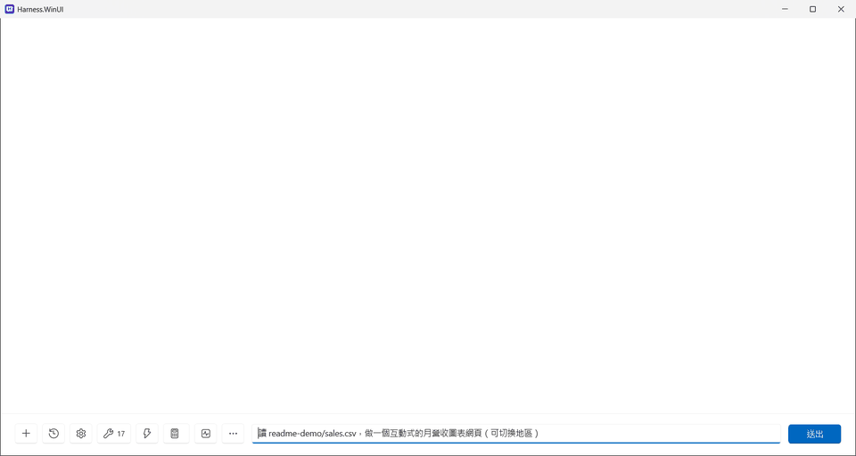
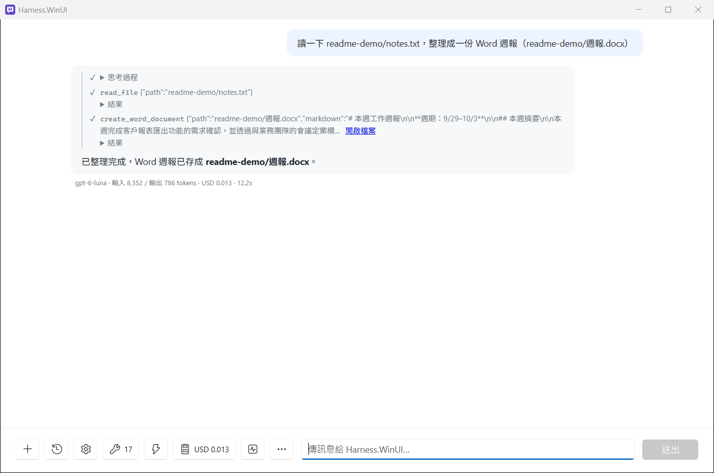
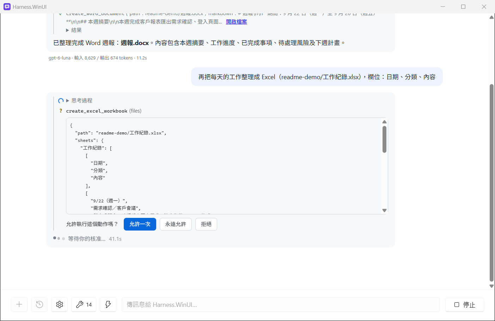
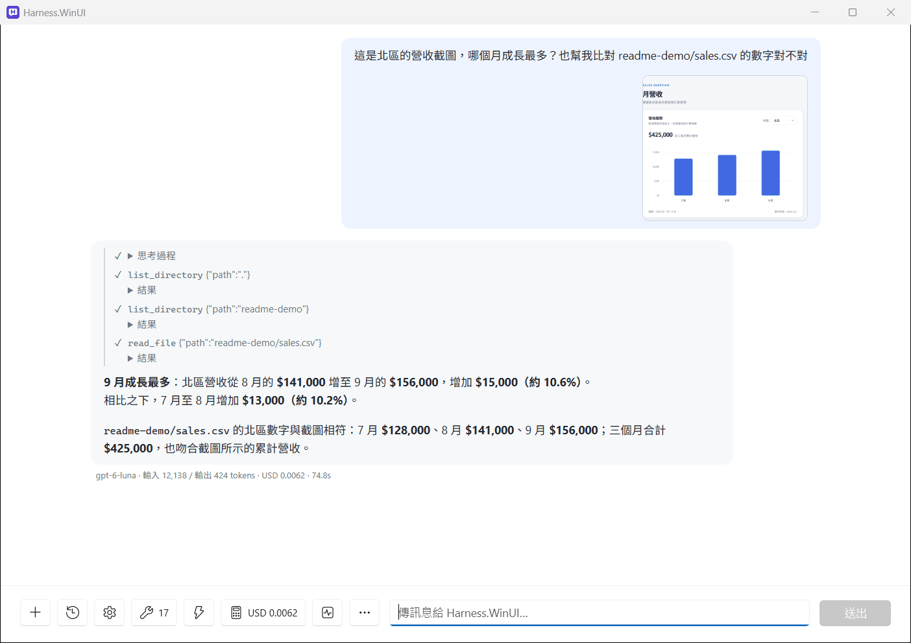
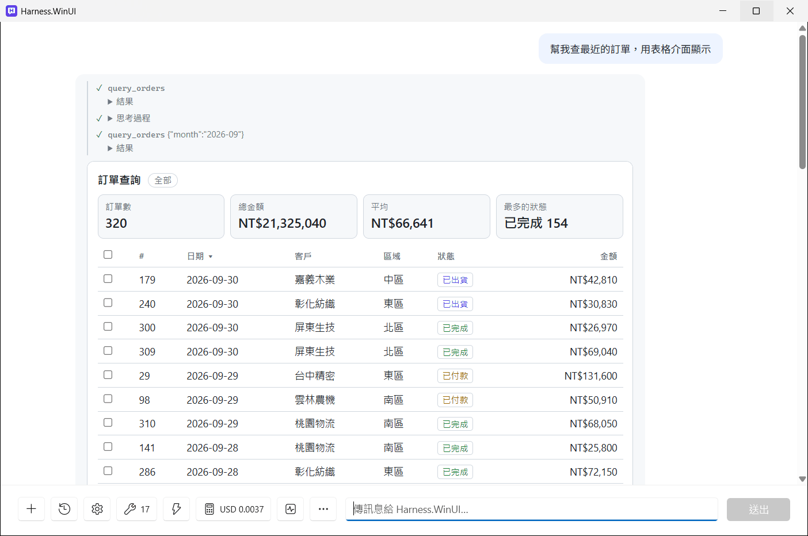
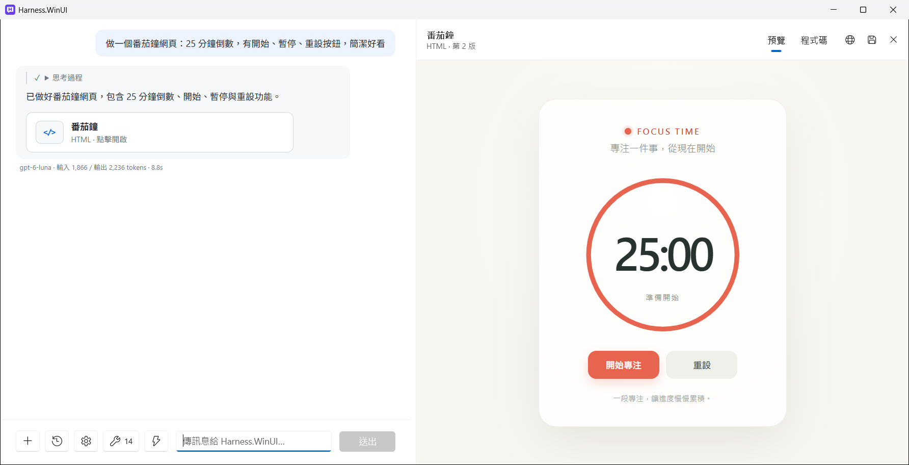
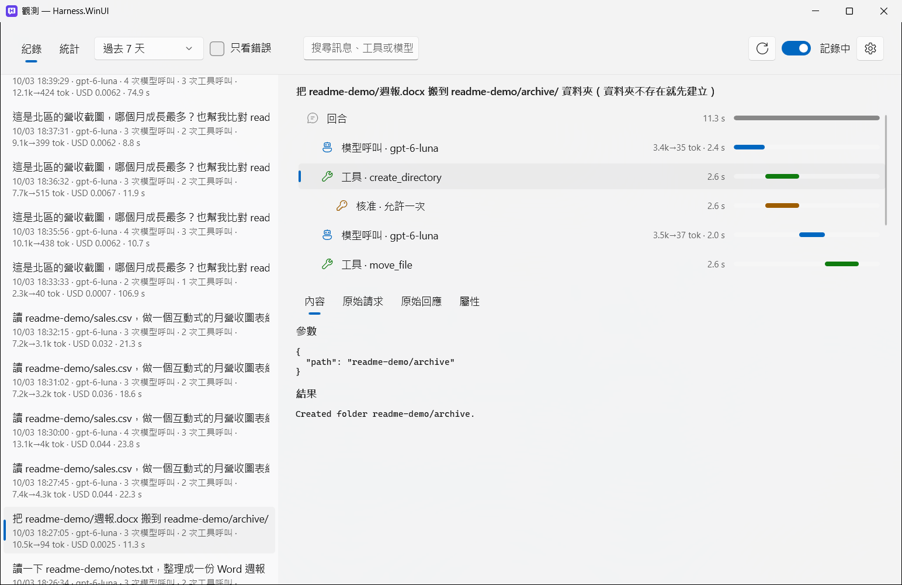
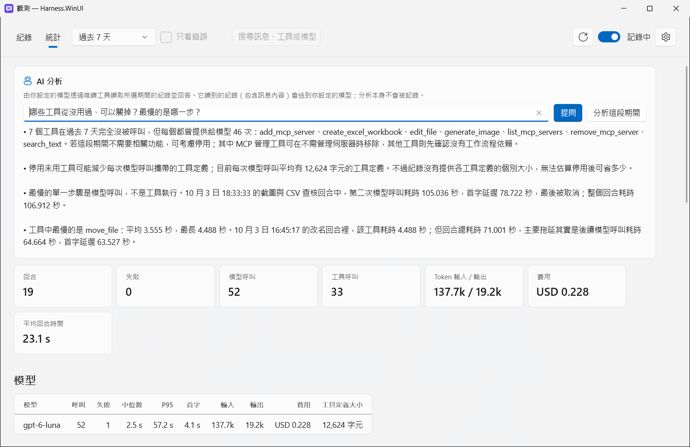

<p align="center">
  
</p>

<h1 align="center">Harness.WinUI</h1>

<p align="center">
  A lightweight, native Windows AI agent — WinUI 3 + .NET 10, works with any OpenAI-compatible endpoint.
</p>

<p align="center">
  <a href="#english">English</a> | <a href="#繁體中文">繁體中文</a>
</p>

<p align="center">
  
  
  
  <a href="https://github.com/breezy89757/Harness.WinUI/releases/latest"></a>
</p>

<p align="center">
  
</p>

---

<a name="english"></a>
## English

Harness.WinUI reads and writes files, plugs into MCP tools, and previews what it builds as it goes.

### Features

- **Native and lightweight**: WinUI 3 + .NET 10, no Electron, no Node.js. Model calls, tools and file handling all run in one process.
- **Any OpenAI-compatible endpoint**: Azure OpenAI, OpenAI, LiteLLM and more. Official services use the Responses API (reasoning models need it to call tools); everything else uses Chat Completions.
- **See what the agent is doing**: reasoning, the arguments and result of every tool call, token usage, model name and response time are all shown.
- **Live artifact panel**: web pages, SVG, Mermaid diagrams and Markdown documents preview in a side panel while they are being written, with version history, Save As, and Open in browser.
- **Built-in file tools, confined to a sandbox**: list, read, search, write and exact replace. Reads text from `.docx`, `.xlsx`, `.pptx` and `.pdf`, and **creates real Word and Excel files**.
- **You approve anything with side effects**: writing files or changing settings shows a confirmation card: Allow once, Always allow, or Deny.
- **MCP**: stdio and Streamable HTTP servers. Manage them in the UI, or just ask the agent to add one in the chat.
- **MCP Apps**: tools that come with their own UI (`io.modelcontextprotocol/ui`) render it right in the chat, e.g. a database query shown as an interactive table. Each app runs in an isolated, sandboxed frame with the CSP it declares; the model sees only the tool's text summary.
- **Image generation**: works with gpt-image models; images show up right in the conversation.
- **Agent Skills**: drop a folder with a `SKILL.md` into `~/.claude/skills`, `~/.agents/skills` or Harness.WinUI's skills folder, and the agent loads it when a request matches.
- **Paste and drop attachments**: paste a screenshot or copied files with Ctrl+V, or drag files onto the window. Images go to the model as images; text, Office and PDF files as text.
- **Know what it costs**: every reply shows its tokens and cost; the usage button totals the conversation, today, this month and all time. Set prices per 1M tokens in Settings.
- **Notifications**: when the window is in the background, a Windows notification and a flashing taskbar button tell you a reply finished or something needs your approval.
- **Conversation history**: stored locally in SQLite; reopening the app restores the model's context too.
- **Stop anytime, tune quality**: stop a reply mid-stream (or press Esc). Switch reasoning effort and image quality whenever you like.
- **Observability**: turn on recording to see every turn's model calls, tool calls and approval waits on a timeline, the exact request and response sent to the provider, statistics per model, tool and skill, and ask your model to analyze them. Records stay on your PC; optional OTLP export to Aspire Dashboard, Langfuse and the like.
- **Make it yours**: Ctrl + plus / minus (or Ctrl + wheel) changes the text size; right-click the toolbar to choose which buttons show.
- **English and Traditional Chinese UI**: the model replies in the language you write in.

### Screenshots

The screenshots show the Traditional Chinese UI; the English UI has the same layout.

| File tools: read notes, create a Word report | Actions with side effects need approval |
|---|---|
|  |  |

| Paste or drop a screenshot and ask about it | MCP Apps: a tool's own interactive UI in the chat |
|---|---|
|  |  |

| Artifact panel: live preview |
|---|
|  |

| Observability: each turn as a timeline, with what the model saw | Statistics, and AI analysis of the records |
|---|---|
|  |  |

### Download

Install it from the [Microsoft Store](https://apps.microsoft.com/detail/9pfs9cggk7vb), or get the portable build from [Releases](https://github.com/breezy89757/Harness.WinUI/releases/latest). The portable build has no installer: unzip and run.

| File | For |
|---|---|
| `Harness.WinUI-<version>-win-x64.zip` | Most Intel / AMD PCs |
| `Harness.WinUI-<version>-win-arm64.zip` | ARM PCs (e.g. Snapdragon Copilot+ PCs) |

Unzip to any folder and run `Harness.WinUI.exe`. On first launch, enter your model endpoint and API key in Settings. The executable is not code-signed, so SmartScreen may warn you the first time: choose **More info → Run anyway**.

### Getting started

#### Requirements

- Windows 10 1809 or later, or Windows 11 (x64 / ARM64)
- [Microsoft Edge WebView2 Runtime](https://developer.microsoft.com/microsoft-edge/webview2/) (built into Windows 11)
- Building requires the [.NET 10 SDK](https://dotnet.microsoft.com/download/dotnet/10.0)

The .NET runtime and the Windows App Runtime are copied into the output folder, so the target machine doesn't need either installed.

#### Build and run

```bash
dotnet build Harness.WinUI.sln -p:Platform=x64
```

```bash
./src/Harness.WinUI/bin/x64/Debug/net10.0-windows10.0.19041.0/win-x64/Harness.WinUI.exe
```

#### Package as MSIX (Microsoft Store)

```powershell
.\build-msix.ps1
```

Builds Release for x64 and ARM64 and produces `release\Harness.WinUI_<version>.msixbundle`, ready to upload to Partner Center. The version comes from `<Version>` in `src/Harness.WinUI/Harness.WinUI.csproj`. Before publishing your own build, set the Identity in `src/Harness.WinUI/Package.appxmanifest` to the values Partner Center gives you.

#### Configure a model

On first launch the settings dialog opens automatically. Fill in:

| Field | Example |
|---|---|
| Endpoint | `https://<your-resource>.openai.azure.com/openai/v1`, `https://api.openai.com/v1`, or a LiteLLM URL |
| Model | Deployment name / model name |
| API Key | Encrypted with Windows DPAPI and stored locally, **never in plain text** |
| Image model (optional) | e.g. `gpt-image-2`, using the same endpoint and key |

For development you can use a config file instead: put the endpoint and model in `appsettings.local.json` (gitignored) and the API key in the `HARNESS_PROVIDER_APIKEY` environment variable.

#### Try it

- "Turn notes.txt in the sandbox into a weekly report in Word"
- "Make a Pomodoro timer web page" / "Draw a Mermaid diagram of this flow"
- "Add an MCP server named mslearn at https://learn.microsoft.com/api/mcp"

The sandbox defaults to the `sandbox` folder inside the data folder (see Data and privacy below). You can point it at another folder in Settings, or turn the file tools off.

### Data and privacy

Everything is stored locally. Nothing is sent anywhere except the model endpoint you configure (and any MCP servers you add). See the [privacy policy](PRIVACY.md).

Data folder: the portable build and builds you run yourself use `%LOCALAPPDATA%\Harness.WinUI\`; the Microsoft Store version uses the app's own folder (`%LOCALAPPDATA%\Packages\<Harness.WinUI package>\LocalState\`), which is removed when you uninstall.

| File | Contents |
|---|---|
| `settings.json` | Endpoint and model; API key encrypted with DPAPI |
| `secrets.json` | MCP header secrets (DPAPI) |
| `mcp.json` | MCP server configuration |
| `permissions.json` | Tools you chose to "Always allow" |
| `history.db` | Conversation history |
| `usage.db` | Token usage and cost per reply |
| `preferences.json` | Language, sandbox, prices, text size, toolbar and other preferences |
| `trace.db` | Observability records, only when recording is on (kept 30 days by default) |
| `skills\` | Your skills (`SKILL.md` folders) |
| `artifacts\` | Artifact files |

The chat view never runs HTML produced by the model. Artifacts run in a separate WebView with no message channel to the app, and only links you click yourself open in your external browser.

### Project layout

```
src/
  Harness.Core/               Agent, model connection, MCP, built-in tools, approvals, settings encryption, history (net10.0, no UI dependency)
  Harness.MarkdownRendering/  Markdown → HTML, chat page, highlight.js / mermaid
  Harness.WinUI/              WinUI 3 desktop app
tools/Harness.DevConsole/     Command-line tool for testing Core without the UI
docs/                         Logo and screenshots
```

Main packages: Microsoft.Agents.AI, Microsoft.Extensions.AI, OpenAI .NET SDK, ModelContextProtocol, Open XML SDK, PdfPig, Microsoft.Data.Sqlite, CommunityToolkit.Mvvm.

---

<a name="繁體中文"></a>
## 繁體中文

輕量的 Windows 原生 AI 助手：會讀寫檔案、接 MCP 工具，並即時預覽它做出的成品。

### 特色

- **原生又輕量**：WinUI 3 + .NET 10，不用 Electron，也不用 Node.js。模型連線、工具、檔案處理全部在同一個行程內完成。
- **任何 OpenAI 相容端點都能接**：Azure OpenAI、OpenAI、LiteLLM 等。官方服務自動走 Responses API（推理模型呼叫工具需要這個），其他走 Chat Completions。
- **看得到 agent 在做什麼**：思考過程、每一次工具呼叫的參數和結果、token 用量、模型名稱、回應時間都會顯示出來。
- **即時成品面板**：網頁、SVG、Mermaid 圖表、Markdown 文件會在側邊面板邊寫邊預覽，而且有版本紀錄，可以另存或用瀏覽器開啟。
- **內建檔案工具，只能在沙盒內動作**：列出、讀取、搜尋、寫入、精確取代。可以讀 `.docx`、`.xlsx`、`.pptx`、`.pdf` 的文字，也能**直接產生真正的 Word / Excel 檔**。
- **有副作用的動作都要你核准**：寫檔、改設定前會跳出確認卡片，可選「允許一次」、「永遠允許」或「拒絕」。
- **MCP**：支援 stdio 和 Streamable HTTP 兩種 server。可以在介面上管理，也能直接在對話裡請 agent 幫你新增。
- **MCP Apps**：自帶介面的工具（`io.modelcontextprotocol/ui`）會直接在對話裡顯示，例如把資料庫查詢結果呈現成可操作的表格。每個 App 在獨立的沙盒框架中執行，只套用它宣告的 CSP；模型只會看到工具的文字摘要。
- **生圖**：接 gpt-image 系列模型，圖片直接顯示在對話裡。
- **Agent Skills**：把含 `SKILL.md` 的資料夾放進 `~/.claude/skills`、`~/.agents/skills` 或 Harness.WinUI 的技能資料夾，請求符合時 agent 會自動載入。
- **貼上、拖曳附件**：Ctrl+V 貼上截圖或複製的檔案，或直接把檔案拖進視窗。圖片以圖片送給模型，文字、Office、PDF 檔轉成文字。
- **費用一目了然**：每則回覆都顯示 token 數和費用；用量按鈕可看本次對話、今天、本月和全部的累計。每 100 萬 token 的價格在設定中填入。
- **通知**：視窗在背景時，回覆完成或需要你核准，會跳出 Windows 通知並閃爍工作列按鈕。
- **對話紀錄**：存在本機 SQLite，重新打開時連模型的上下文一起接回來。
- **隨時停止、可調品質**：回覆進行中可以按停止（或 Esc）。推理強度和生圖品質可以隨時切換。
- **可觀測性**：開啟記錄後，可以在時間軸上看到每個回合的模型呼叫、工具呼叫與核准等待，送給供應商的原始請求與回應，各模型、工具、技能的統計，還能請模型分析這些紀錄。紀錄只存在本機；可選擇用 OTLP 匯出到 Aspire Dashboard、Langfuse 等。
- **依你的習慣調整**：Ctrl + 加號 / 減號（或 Ctrl + 滾輪）調整字型大小；在工具列按右鍵可選擇要顯示哪些按鈕。
- **繁體中文與英文介面**：介面可選繁中或英文。模型會用你輸入的語言回覆，中文一律用台灣用語的繁體中文。

### 截圖

| 檔案工具：讀筆記、產生 Word 週報 | 有副作用的動作要先核准 |
|---|---|
|  |  |

| 貼上或拖入截圖直接提問 | MCP Apps：工具自帶的互動介面直接顯示在對話裡 |
|---|---|
|  |  |

| 成品面板：即時預覽 |
|---|
|  |

| 可觀測性：每個回合的時間軸，以及模型實際看到的內容 | 統計與 AI 分析 |
|---|---|
|  |  |

### 下載

從 [Microsoft Store](https://apps.microsoft.com/detail/9pfs9cggk7vb) 安裝，或到 [Releases](https://github.com/breezy89757/Harness.WinUI/releases/latest) 下載免安裝版（解壓縮就能用）。

| 檔案 | 適用 |
|---|---|
| `Harness.WinUI-<版本>-win-x64.zip` | 一般 Intel / AMD 電腦（大多數人選這個） |
| `Harness.WinUI-<版本>-win-arm64.zip` | ARM 電腦（例如 Snapdragon 的 Copilot+ PC） |

解壓縮到任意資料夾，執行 `Harness.WinUI.exe`，第一次開啟時在設定頁填入模型端點與 API key。執行檔沒有程式碼簽章，第一次開啟時 SmartScreen 可能會跳出警告，按「其他資訊 → 仍要執行」即可。

### 開始使用

#### 需求

- Windows 10 1809 以上或 Windows 11（x64 / ARM64）
- [Microsoft Edge WebView2 Runtime](https://developer.microsoft.com/microsoft-edge/webview2/)（Windows 11 已內建）
- 建置需要 [.NET 10 SDK](https://dotnet.microsoft.com/download/dotnet/10.0)

.NET runtime 和 Windows App Runtime 都會一起放進輸出資料夾，執行的電腦不用另外安裝。

#### 建置與執行

```bash
dotnet build Harness.WinUI.sln -p:Platform=x64
```

```bash
./src/Harness.WinUI/bin/x64/Debug/net10.0-windows10.0.19041.0/win-x64/Harness.WinUI.exe
```

#### 打包成 MSIX（Microsoft Store）

```powershell
.\build-msix.ps1
```

會建置 x64 與 ARM64 的 Release 版，產生 `release\Harness.WinUI_<版本>.msixbundle`，可直接上傳到 Partner Center。版本號取自 `src/Harness.WinUI/Harness.WinUI.csproj` 的 `<Version>`；要發佈自己的版本前，請把 `src/Harness.WinUI/Package.appxmanifest` 的 Identity 換成 Partner Center 提供的值。

#### 設定模型

第一次啟動會自動跳出設定視窗，填入：

| 欄位 | 範例 |
|---|---|
| Endpoint | `https://<your-resource>.openai.azure.com/openai/v1`、`https://api.openai.com/v1`，或 LiteLLM 的網址 |
| Model | 部署名稱 / 模型名稱 |
| API Key | 用 Windows DPAPI 加密後存在本機，**不會以明碼存放** |
| 生圖模型（選填） | 例如 `gpt-image-2`，沿用同一個端點和 key |

開發時也可以改用設定檔：在 `appsettings.local.json`（已 gitignore）填端點和模型，API key 放在環境變數 `HARNESS_PROVIDER_APIKEY`。

#### 試試看

- 「把沙盒裡的 notes.txt 整理成一份 Word 週報」
- 「做一個番茄鐘網頁」「畫一張這個流程的 Mermaid 圖」
- 「幫我加一個 MCP server：名稱 mslearn，網址 https://learn.microsoft.com/api/mcp」

沙盒預設是資料資料夾底下的 `sandbox`（位置見下方「資料與隱私」），可以在設定裡改成其他資料夾，或關閉檔案工具。

### 資料與隱私

所有資料都存在本機，除了你設定的模型端點（和你加入的 MCP server）之外，不會傳到任何地方。詳見[隱私權政策](PRIVACY.md)。

資料夾位置：免安裝版和自行建置的版本在 `%LOCALAPPDATA%\Harness.WinUI\`；Microsoft Store 版在 App 自己的資料夾（`%LOCALAPPDATA%\Packages\<Harness.WinUI 套件>\LocalState\`），解除安裝時會一併移除。

| 檔案 | 內容 |
|---|---|
| `settings.json` | 端點、模型；API key 用 DPAPI 加密 |
| `secrets.json` | MCP header 密鑰（DPAPI） |
| `mcp.json` | MCP server 設定 |
| `permissions.json` | 你選了「永遠允許」的工具 |
| `history.db` | 對話紀錄 |
| `usage.db` | 每則回覆的 token 用量與費用 |
| `preferences.json` | 語言、沙盒、價格、字型大小、工具列等偏好設定 |
| `trace.db` | 觀測紀錄，只在開啟記錄時產生（預設保留 30 天） |
| `skills\` | 你的技能（含 `SKILL.md` 的資料夾） |
| `artifacts\` | 成品檔案 |

聊天畫面不會直接執行模型輸出的 HTML。成品在另一個獨立的 WebView 裡執行，與 App 之間沒有訊息通道；而且只有你親手點擊的連結才會用外部瀏覽器開啟。

### 專案結構

```
src/
  Harness.Core/               Agent、模型連線、MCP、內建工具、核准、設定加密、對話紀錄（net10.0，不依賴 UI）
  Harness.MarkdownRendering/  Markdown → HTML、聊天頁面、highlight.js / mermaid
  Harness.WinUI/              WinUI 3 桌面程式
tools/Harness.DevConsole/     不開 UI 直接測試 Core 的命令列工具
docs/                         Logo 與截圖
```

主要套件：Microsoft.Agents.AI、Microsoft.Extensions.AI、OpenAI .NET SDK、ModelContextProtocol、Open XML SDK、PdfPig、Microsoft.Data.Sqlite、CommunityToolkit.Mvvm。

---

## License

[MIT](LICENSE). Third-party components and their licenses: [THIRD-PARTY-NOTICES.md](THIRD-PARTY-NOTICES.md). Release history: [CHANGELOG.md](CHANGELOG.md).
